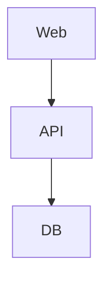
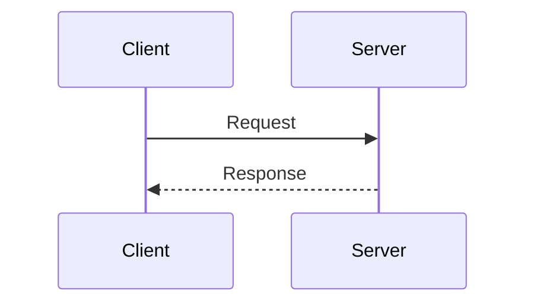

# CLI Reference

Complete reference for all `mmdc` command-line flags and options.

## Table of Contents

- [Synopsis](#synopsis)
- [Input/Output Flags](#inputoutput-flags)
- [Appearance Flags](#appearance-flags)
- [Configuration Flags](#configuration-flags)
- [Output Control Flags](#output-control-flags)
- [Icon Pack Flags](#icon-pack-flags)
- [Information Flags](#information-flags)
- [Input/Output Formats](#inputoutput-formats)
- [Markdown Processing Mode](#markdown-processing-mode)
- [Using stdout](#using-stdout)
- [Exit Codes](#exit-codes)

## Synopsis

```
mmdc [options]
```

All flags use the long-form `--flag` or short-form `-f` syntax. Input (`-i`) is the only required flag for file-based usage.

## Input/Output Flags

### `-i, --input <file>`

Input file path. Accepts `.mmd` (Mermaid) or `.md` (Markdown) files.

- **Type:** string
- **Required:** Yes (unless piping to stdin)

```bash
# Mermaid file
mmdc -i diagram.mmd -o diagram.svg

# Markdown file (processes mermaid code blocks)
mmdc -i README.md -o README-out.md
```

Use `-i -` to read from stdin:

```bash
echo 'graph TD; A-->B' | mmdc -i - -o diagram.svg
```

### `-o, --output <file>`

Output file path. The output format is determined by the file extension (`.svg`, `.png`, `.pdf`) unless overridden by `-e`.

- **Type:** string
- **Default:** Input filename with `.svg` extension

```bash
mmdc -i diagram.mmd -o output.svg
mmdc -i diagram.mmd -o output.png
mmdc -i diagram.mmd -o output.pdf
```

Use `-o -` to write SVG to stdout:

```bash
mmdc -i diagram.mmd -o -
```

### `-e, --outputFormat <format>`

Override the output format regardless of file extension.

- **Type:** string
- **Values:** `svg`, `png`, `pdf`
- **Default:** Determined by `-o` file extension

```bash
# Force PNG output even with .svg extension
mmdc -i diagram.mmd -o diagram.svg -e png
```

### `-I, --svgId <id>`

Set the `id` attribute on the rendered SVG element.

- **Type:** string
- **Default:** `my-svg`

```bash
# Set custom SVG id
mmdc -i diagram.mmd -o diagram.svg -I my-custom-diagram
```

## Appearance Flags

### `-t, --theme <theme>`

Set the Mermaid theme.

- **Type:** string
- **Values:** `default`, `forest`, `dark`, `neutral`
- **Default:** `default`

```bash
mmdc -i diagram.mmd -o diagram.svg -t dark
mmdc -i diagram.mmd -o diagram.svg -t forest
```

### `-b, --backgroundColor <color>`

Set the background color of the output.

- **Type:** string
- **Default:** `white`
- **Accepts:** CSS color names, hex codes, `transparent`

```bash
# Transparent background
mmdc -i diagram.mmd -o diagram.png -b transparent

# Custom color
mmdc -i diagram.mmd -o diagram.png -b "#f0f0f0"
```

### `-w, --width <pixels>`

Set the output width in pixels.

- **Type:** number
- **Default:** `800`

```bash
mmdc -i diagram.mmd -o diagram.png -w 1920
```

### `-H, --height <pixels>`

Set the output height in pixels.

- **Type:** number
- **Default:** `600`

```bash
mmdc -i diagram.mmd -o diagram.png -H 1080
```

### `-s, --scale <factor>`

Set the scale factor for the output. Values greater than 1 produce higher-resolution output.

- **Type:** number
- **Default:** `1`

```bash
# 2x resolution (retina)
mmdc -i diagram.mmd -o diagram.png -s 2

# 3x resolution
mmdc -i diagram.mmd -o diagram.png -s 3
```

## Configuration Flags

### `-c, --configFile <file>`

Path to a Mermaid configuration JSON file. Controls diagram appearance and behavior.

- **Type:** string
- **Default:** None

```bash
mmdc -i diagram.mmd -o diagram.svg -c mermaid-config.json
```

See [configuration.md](configuration.md) for the full config file format.

### `-C, --cssFile <file>`

Path to a CSS file for custom styling of the diagram.

- **Type:** string
- **Default:** None

```bash
mmdc -i diagram.mmd -o diagram.svg -C custom.css
```

The CSS is injected into the rendered diagram and can override default Mermaid styles.

### `-p, --puppeteerConfigFile <file>`

Path to a Puppeteer configuration JSON file. Controls the headless Chromium browser used for rendering.

- **Type:** string
- **Default:** None

```bash
mmdc -i diagram.mmd -o diagram.svg -p puppeteer-config.json
```

Common use cases:
- Custom Chromium path (`executablePath`)
- Disabling sandbox on Linux (`args: ["--no-sandbox"]`)
- Adjusting timeout for large diagrams

See [configuration.md](configuration.md) for Puppeteer config details.

## Output Control Flags

### `--pdfFit`

Scale the diagram to fit the PDF page dimensions. Only applies when generating PDF output.

- **Type:** boolean
- **Default:** `false`

```bash
mmdc -i diagram.mmd -o diagram.pdf --pdfFit
```

### `-q, --quiet`

Suppress log output. Useful for scripted workflows.

- **Type:** boolean
- **Default:** `false`

```bash
mmdc -i diagram.mmd -o diagram.svg -q
```

## Icon Pack Flags

### `--iconPacks <names>`

Specify icon pack names to load (comma-separated). Icon packs provide additional icons for architecture diagrams.

- **Type:** string (comma-separated list)
- **Default:** None

```bash
mmdc -i arch.mmd -o arch.svg --iconPacks logos,aws
```

### `--iconPacksNamesAndUrls <json>`

Specify custom icon packs with names and URLs as a JSON string.

- **Type:** string (JSON)
- **Default:** None

```bash
mmdc -i arch.mmd -o arch.svg --iconPacksNamesAndUrls '{"custom": "https://example.com/icons.json"}'
```

## Information Flags

### `-V, --version`

Display the mermaid-cli version.

```bash
mmdc --version
```

### `-h, --help`

Display help information with all available flags.

```bash
mmdc --help
```

## Input/Output Formats

### Input Formats

| Extension | Type | Description |
|-----------|------|-------------|
| `.mmd` | Mermaid | Single diagram definition |
| `.md` | Markdown | Markdown with mermaid code blocks |

### Output Formats

| Extension | Type | Description | Best For |
|-----------|------|-------------|----------|
| `.svg` | SVG | Scalable vector graphics | Web, documentation, scaling |
| `.png` | PNG | Raster image | Presentations, fixed-size images |
| `.pdf` | PDF | Portable document format | Print, document embedding |

### Format Selection Priority

1. `-e` flag (highest priority, overrides extension)
2. `-o` file extension
3. Default: `svg`

## Markdown Processing Mode

When the input is a Markdown file (`.md` or `.markdown` extension), mmdc operates in Markdown processing mode:

1. Scans the input file for fenced code blocks with `mermaid` language identifier
2. Renders each mermaid block to the specified output format
3. Replaces each block with an `` tag in the output Markdown file
4. Generated image files are named `<output-basename>-<index>.svg` (or `.png`/`.pdf`)

### Example

**Input (`doc.md`):**
````markdown
# Architecture



Some text here.


````

**Command:**
```bash
mmdc -i doc.md -o doc-out.md
```

**Output (`doc-out.md`):**
```markdown
# Architecture


Some text here.


```

**Generated files:** `doc-out-1.svg`, `doc-out-2.svg`

## Using stdout

Write SVG output directly to stdout using `-o -`:

```bash
# Pipe SVG to another tool
mmdc -i diagram.mmd -o - | some-tool

# Capture SVG in a variable
SVG=$(mmdc -i diagram.mmd -o -)

# Pipe from stdin to stdout
echo 'graph TD; A-->B' | mmdc -i - -o -
```

**Note:** stdout output only works with SVG format. For PNG or PDF, you must specify an output file.

## Exit Codes

| Code | Meaning |
|------|---------|
| `0` | Success |
| `1` | Error (invalid input, rendering failure, file not found) |
